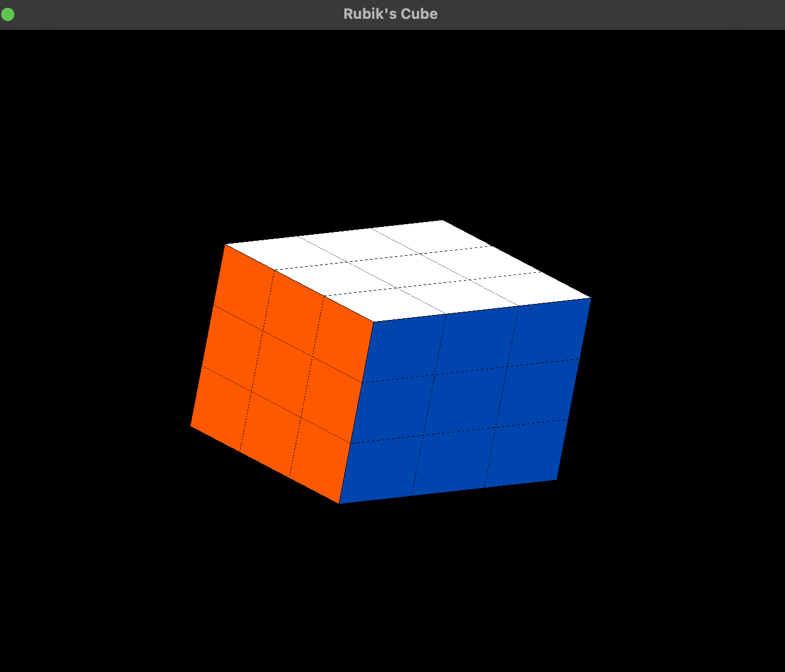
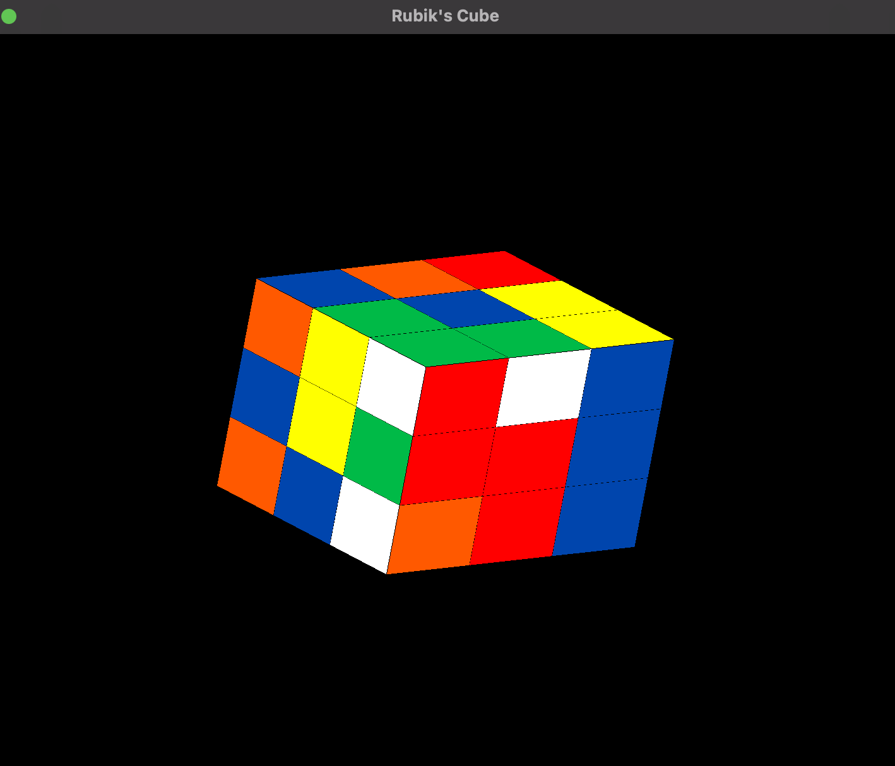

# **Rubik's Cube**
#### > COMP 410/510 - Computer Graphics
#### > Spring 2025 – Programming Assignment 2

---

#### > *Ali Han Kılınç & Abdurrahman Çağlayan*

---
# Project Description
- This project implements a fully interactive 3D Rubik’s Cube simulator using OpenGL version 3.4.
- It features a realistic 3x3x3 cube, smooth face rotations, random scrambling, full user interaction via keyboard and mouse, and a picking system for intuitive manipulation for the faces and layers.
---

# How to Build
**Requirements:**
- C++ Compiler supporting C++11
- CMake 3.16+
- OpenGL 3.4
- No need for external GLEW, GLFW, or Angel installations

**Portability:**
- GLEW, GLFW, and Angel source files are included directly in the project (deps/ directory).
- They are compiled and linked automatically through the provided CMakeLists.txt.
- No external dependency installations are required.
- This makes the project self-contained and portable anywhere CMake is available.
---
# Controls
| Action                | Key / Mouse                           |
| --------------------- | ------------------------------------- |
| Rotate view           | Arrow keys                            |
| Scramble cube         | S                                     |
| Reset cube            | R                                     |
| Exit program          | ESC                                   |
| Select Axis           | X / Y / Z                             |
| Select Layer          | 1 / 2 / 3 (-1, 0, +1)                 |
| Rotate selected layer | + / -                                 |
| Rotate face (mouse)   | Left click (+90°), Right click (-90°) |
| Show help             | H                                     |
---
# Technical Details (Detailed)

### Rendering
- The program uses **OpenGL 3.4 Core Profile**
- **Vertex shader** and **Fragment shader** are loaded at runtime via Angel’s `InitShader.cpp`.


### Rubik's Cube Modeling

* The Rubik’s Cube is composed of **27 smaller sub-cubes**, each modeled by the `Cube` class.

* Each `Cube`:

    * Stores its **position** (`position` field).
    * Stores its **individual face colors** (`faceColors[6]` array).
    * Has its own **model transformation matrix** (`modelMatrix`).
    * Has a **picking ID** for unique identification during interaction.

* **Colors** are defined using `vec3` RGB values in `Colors.h` for standard Rubik's cube colors:

    * Red, Orange, White, Yellow, Blue, Green, Black

### Cube Management: `RubiksCube`

* Manages all 27 `Cube` instances.

* Maintains a **global rotation matrix** (`globalRotation`) that rotates the entire cube view.

* Methods:

    * `draw(GLuint shaderProgram)`: Renders all 27 cubes.
    * `scramble()`: Randomly rotates layers to create an initial scrambled state.
    * `reset()`: Resets the cube back to the solved state.
    * `rotateAxisLayer(char axis, int coord, bool positive)`: Rotates a layer along a given axis based on coordinate and direction.

* **Smooth Rotation Animation:**

    * Uses frame-by-frame updates in the `update()` function.
    * Each rotating face turns a few degrees per frame (`rotationSpeed = 3.0f`).
    * Once total rotation reaches **90 degrees**, the rotation stops.

### User Interaction

* **Keyboard Inputs** (via `keyCallback`):

    * Rotate entire cube (Arrow Keys).
    * Reset (`R`) / Scramble (`S`) the cube.
    * Select rotation axis (`X`, `Y`, `Z` keys).
    * Select which layer (-1, 0, +1) on the selected axis (`1`, `2`, `3` keys).
    * Rotate a selected layer (`+` or `-` keys) or (\* and - on macos)
    * Show help menu (`H` key).
    * Exit the application (`ESC` key).

* **Mouse Inputs** (via `mouseButtonCallback`):

    * **Left-click**: Rotate selected layer **+90°**.
    * **Right-click**: Rotate selected layer **-90°**.


### Shaders

* **Vertex Shader
    * Applies the **view-projection matrix** to transform vertices to clip space.

* **Fragment Shader
    * Colors each cube face based on the assigned `faceColors`.
    * Supports switching to picking colors if needed.

* Shaders are loaded at runtime using Angel’s **InitShader.cpp** helper (included in `deps/Angel/`).


### Dependencies and Build System

* **GLEW** and **GLFW** are included in the `deps/` directory:

    * `glew/` and `glfw/` are **built from source** via the provided `CMakeLists.txt`.
* **Angel Library**:

    * Used for shader management and matrix/vector math (`mat.h`, `vec.h`, `mat4`).
* **CMake Build**:

    * GLEW is built as a **static library**.
    * GLFW is built as a **source add\_subdirectory**.
    * Angel’s shader utilities are compiled manually.
    * No external dependency installation is required — portable build.


### Performance and Quality Features

* **Edge drawing**: Each cube also draws its edges in black to visually separate sub-cubes clearly.
* **Continuous updates**: `update()` function ensures animation is smooth even across different system frame rates.

---
# Project Structure
```plaintext
RubiksCubeProject/
├── README.md
├── CMakeLists.txt
├── images/ 
├── shaders/
│ ├── vertex_shader.glsl
│ ├── fragment_shader.glsl
├── src/
│ ├── main.cpp
│ ├── Cube.cpp
│ ├── RubiksCube.cpp
│ ├── Controls.cpp
│ ├── Globals.cpp
├── include/
│ ├── Cube.h
│ ├── RubiksCube.h
│ ├── Controls.h
│ ├── Globals.h
│ ├── Colors.h
├── deps/
│ ├── glew/ 
│ ├── glfw/ 
│ ├── Angel/
|   ├── src/
│       ├── InitShader.cpp
│   ├── include/
│       ├── mat.h
│       ├── vec.h
│       ├── Angel.h
│       ├── CheckError.h
```
## Screenshots

### 1


### 2


### 3


### 4

